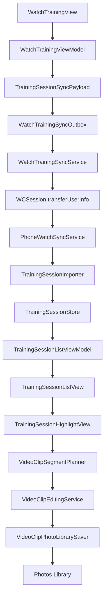
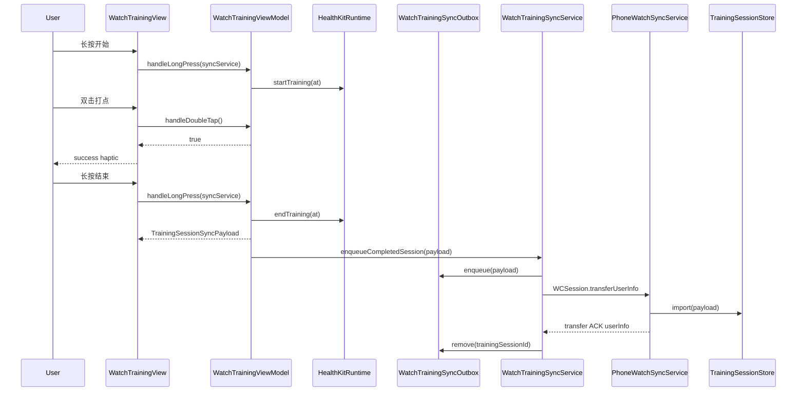
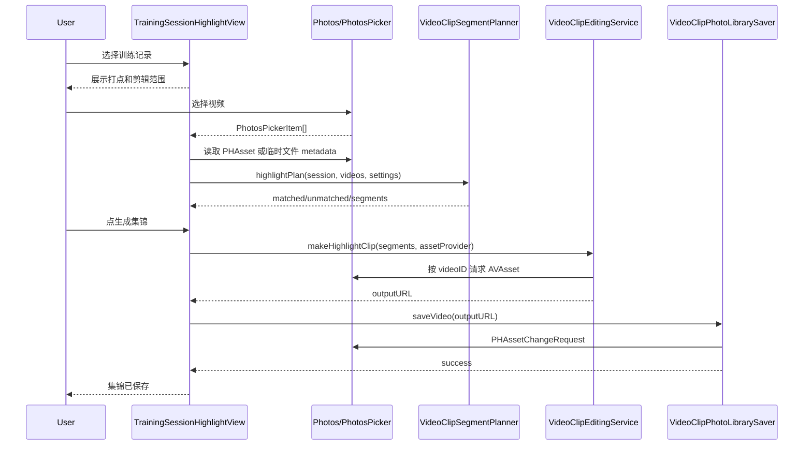
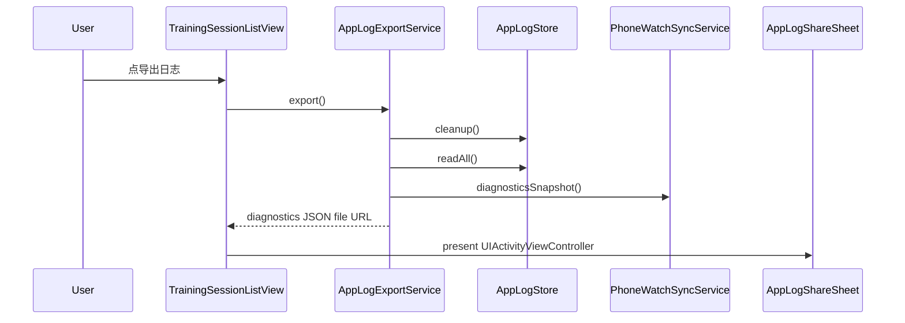

# ShotMarker 当前代码情况说明

生成日期：2026-05-17
分析分支：`main`
当前提交：`115322d docs: 补充日志导出P0验收结果`
工作区状态：生成本文档前 `git status --short` 无输出，即没有未提交改动。
文档性质：这是对当前仓库代码的现状审计和说明，不是未来开发计划。

## 1. 总体结论

ShotMarker 当前是一个以 SwiftUI 为主的 Apple 生态个人项目，包含 iPhone App、Apple Watch App、共享同步 payload、iPhone 单元测试和 Watch 单元测试。产品目标是让用户训练时在 Apple Watch 上打点，训练结束后同步到 iPhone，随后在 iPhone 上选择对应训练视频并自动生成集锦保存到相册。

当前代码已经覆盖了 P0 主链路的大部分技术骨架：

- Watch 端可以长按开始/结束训练，训练中双击记录打点。
- Watch 端结束训练时会生成跨端同步 payload，并通过 WatchConnectivity outbox 发送到 iPhone。
- iPhone 端可以接收、幂等导入训练记录，并回传 ACK。
- iPhone 首页可以展示训练记录，支持进入集锦生成页。
- 集锦生成页可以选择多个视频，按打点计算片段，使用 AVFoundation 拼接视频并保留音频。
- 生成后可请求相册权限并保存到 Photos。
- iPhone 端已有结构化日志、日志滚动存储和一键导出诊断文件。
- 单元测试覆盖比较多，测试文件共 17 个，`func test...` 计数为 101 个。

但当前实现和 PRD / P0 验收标准之间仍有几处关键差异：

- PRD 要求默认剪辑窗口是“打点前 10 秒、打点后 3 秒”，代码默认是 5 秒和 2 秒。
- PRD 要求重叠打点片段不合并，代码会合并同一视频内重叠或相邻 1 秒以内的片段。
- PRD 要求训练记录列表展示“是否已剪辑、同步状态”，当前 `TrainingSession` 没有这些字段，列表也不展示。
- PRD 要求保存成功后将训练记录标记为已剪辑，当前保存成功后只弹提示并清空选择，没有回写训练记录状态。
- PRD 提到 `SelectedVideo`、`HighlightJob` 等核心对象，当前只有运行时临时结构，没有持久化 job 模型。
- 视频格式校验目前主要依赖 Photos/AVFoundation 是否能读到创建时间、时长和视频轨道，没有显式限制“苹果手机录制的标准格式视频”。
- 当前本机构建/测试环境存在 Xcode/CoreSimulator 版本不匹配，本文档生成时无法完成完整 `xcodebuild build/test` 验证。

## 2. 仓库结构

仓库根目录：

```text
/Users/runhaozhang/Documents/project/ShotMarker
├── AGENTS.md
├── .swift-version
├── .swiftlint.yml
├── Config/
│   └── ShotMarkerWatchApp-Info.plist
├── Shared/
│   └── TrainingSessionSyncPayload.swift
├── ShotMarker/
│   ├── ShotMarkerApp.swift
│   ├── ContentView.swift
│   ├── Models/
│   ├── Services/
│   ├── ViewModels/
│   ├── Views/
│   └── Assets.xcassets/
├── ShotMarkerWatchApp/
│   ├── ShotMarkerWatchApp.swift
│   ├── Services/
│   ├── ViewModels/
│   ├── Views/
│   ├── ShotMarkerWatchApp.entitlements
│   └── Assets.xcassets/
├── ShotMarkerTests/
├── ShotMarkerWatchAppTests/
├── ShotMarker.xcodeproj/
└── docs/
    ├── PRD.md
    └── plans/
```

代码规模：

- Swift 总行数：7,468 行。
- 最大业务文件：
  - `ShotMarker/Views/TrainingSessionHighlightView.swift`：614 行。
  - `ShotMarker/Services/VideoClipEditingService.swift`：551 行。
  - `ShotMarkerTests/PhoneWatchSyncServiceTests.swift`：459 行。
  - `ShotMarkerTests/VideoClipEditingServiceTests.swift`：442 行。
  - `ShotMarkerTests/TrainingSessionListViewModelTests.swift`：437 行。
  - `ShotMarkerWatchApp/Services/WatchTrainingSyncService.swift`：325 行。
  - `ShotMarker/Services/PhoneWatchSyncService.swift`：319 行。

没有发现 `Package.swift`、`Podfile`、`Cartfile`、`.swiftformat` 或外部依赖声明。当前依赖基本都是 Apple 系统框架。

## 3. 开发规则与当前 Git 状态

`AGENTS.md` 对该项目有明确规则：

- 个人项目，直接在 `main` 开发。
- 不创建、不使用 git worktree。
- 除非用户明确要求，不创建 feature branch。
- 编辑文件前确认当前分支是 `main`。
- 不丢弃或覆盖用户未提交改动。

本文档生成前确认：

- `git branch --show-current` 输出 `main`。
- `git status --short` 无输出。
- 没有创建分支，也没有使用 worktree。

最近提交：

```text
115322d docs: 补充日志导出P0验收结果
f9ec228 feat: 记录视频选择和集锦生成日志
77f9639 feat: 记录训练记录列表日志
6952198 feat: 记录应用启动和手表同步日志
00744e0 feat: 添加首页日志导出入口
7534d67 feat: 添加诊断日志导出服务
878806f feat: 添加应用日志写入入口
d1f8147 feat: 添加本地日志滚动存储
fe2e02e feat: 添加结构化日志事件模型
27046ad feat: 持久化集锦剪辑时间设置
172ba4f fix: 优化长视频集锦生成并处理 iCloud 读取失败
ab091f5 feat: 添加训练视频集锦生成流程
```

## 4. 技术栈与工程配置

### 4.1 工具链

当前机器工具链：

- Xcode：`Xcode 26.5`，build version `17F42`。
- Swift：`Apple Swift version 6.3.2`。
- `.swift-version`：`6.3`。

Xcode project 中各 target 的 `SWIFT_VERSION` 仍是 `5.0`，但同时启用了若干 Swift 6 迁移相关设置：

- `SWIFT_APPROACHABLE_CONCURRENCY = YES`
- `SWIFT_DEFAULT_ACTOR_ISOLATION = MainActor`
- `SWIFT_UPCOMING_FEATURE_MEMBER_IMPORT_VISIBILITY = YES`

这意味着项目实际处在“Swift 5 language mode + Swift 6 工具链/并发设置”的状态。代码里也有不少为 Swift 6 并发隔离准备的写法，例如 Watch HealthKit manager 中多处显式切回 `MainActor`。

### 4.2 Xcode targets

`xcodebuild -list -project ShotMarker.xcodeproj` 能列出：

- Targets:
  - `ShotMarker`
  - `ShotMarkerWatchApp`
  - `ShotMarkerWatchAppTests`
  - `ShotMarkerTests`
- Schemes:
  - `ShotMarker`
  - `ShotMarkerWatchApp`
- Build configurations:
  - `Debug`
  - `Release`

工程使用 Xcode 新的 `PBXFileSystemSynchronizedRootGroup`，因此 `.pbxproj` 中 Sources build phase 为空，源文件通过文件系统同步分组进入 target。当前分组：

- `ShotMarker` target 包含 `Shared` 与 `ShotMarker`。
- `ShotMarkerWatchApp` target 包含 `Shared` 与 `ShotMarkerWatchApp`。
- `ShotMarkerTests` 依赖 `ShotMarker`。
- `ShotMarkerWatchAppTests` 依赖 `ShotMarkerWatchApp`。
- `ShotMarker` target 显式依赖并嵌入 `ShotMarkerWatchApp`。

### 4.3 Bundle、平台与部署版本

iPhone 主 App：

- Bundle ID：`com.heji.ShotMarker`
- Product：`ShotMarker.app`
- `IPHONEOS_DEPLOYMENT_TARGET = 26.4`
- `MACOSX_DEPLOYMENT_TARGET = 26.4`
- `XROS_DEPLOYMENT_TARGET = 26.4`
- `SUPPORTED_PLATFORMS = iphoneos iphonesimulator macosx xros xrsimulator`
- `TARGETED_DEVICE_FAMILY = 1,2,7`
- `CURRENT_PROJECT_VERSION = 4`
- `MARKETING_VERSION = 1.0`

Watch App：

- Bundle ID：`com.heji.ShotMarker.watchkitapp`
- Product：`ShotMarkerWatchApp.app`
- `WATCHOS_DEPLOYMENT_TARGET = 26.2`
- `SUPPORTED_PLATFORMS = watchos watchsimulator`
- `TARGETED_DEVICE_FAMILY = 4`
- `SKIP_INSTALL = YES`
- 使用自定义 Info.plist：`Config/ShotMarkerWatchApp-Info.plist`

测试 target：

- `ShotMarkerTests` Bundle ID：`com.heji.ShotMarkerTests`
- `ShotMarkerWatchAppTests` Bundle ID：`com.heji.ShotMarkerWatchAppTests`

### 4.4 权限配置

iPhone 主 App 通过自动生成 Info.plist 写入相册权限文案：

- `NSPhotoLibraryAddUsageDescription`：用于保存生成的训练集锦。
- `NSPhotoLibraryUsageDescription`：用于读取所选训练视频的拍摄时间和片段内容。

Watch App 的 `Config/ShotMarkerWatchApp-Info.plist` 包含：

- `NSHealthShareUsageDescription`
- `NSHealthUpdateUsageDescription`
- `WKApplication = true`
- `WKBackgroundModes = workout-processing`
- `WKCompanionAppBundleIdentifier = com.heji.ShotMarker`

Watch entitlements：

- `com.apple.developer.healthkit = true`

### 4.5 Lint 配置

`.swiftlint.yml` 当前很小：

- `line_length.warning = 140`
- `line_length.error = 180`
- 注释和 URL 忽略长度。
- `trailing_comma.mandatory_comma = true`

没有看到脚本把 SwiftLint 接入 Xcode build phase，也没有看到 SwiftLint 运行记录。

### 4.6 App Store 公开页面地址

当前用于 App Store Connect 的公开页面已经部署到 `zhangrh.shop`：

- Support URL：`https://zhangrh.shop/shotmarker/support`
- Privacy Policy URL：`https://zhangrh.shop/shotmarker/privacy`

注意：线上路径已统一为 `shotmarker`，与仓库名 `ShotMarker` 的小写拼写保持一致；旧 `shotmaker` 路径已下线，`/shotmaker/` 和 `/shotmaker/support` 当前返回 404。本仓库不再保留这两个页面的本地 HTML 副本。

## 5. 产品需求与当前实现对齐

PRD 位于 `docs/PRD.md`，日期为 2026-05-01，状态为草案。P0 核心包括 Watch 打点、手机训练记录列表、视频选择、自动剪辑、保存到相册。

| PRD/P0 要求 | 当前代码状态 | 说明 |
|---|---|---|
| Watch 端展示一个主按钮 | 已实现 | `WatchTrainingView` 中圆形主按钮。 |
| 长按开始训练 | 已实现 | `WatchTrainingViewModel.handleLongPress()` 从 `.notTraining` 切到 `.training`。 |
| 训练中双击按钮记录打点 | 已实现 | `handleDoubleTap()` 仅在 `.training` 状态追加时间。 |
| 打点记录绝对时间 | 已实现 | 直接保存 `Date`。 |
| 打点成功后震动提醒 | 已实现 | Watch UI 双击成功后 `WKInterfaceDevice.current().play(.success)`。 |
| 再次长按结束训练 | 已实现 | 结束时生成 `TrainingSessionSyncPayload`。 |
| 每次训练形成一条训练记录 | 已实现到同步 payload 层 | Watch 不做完整训练历史，只产生待同步 payload。 |
| 结束后批量同步到手机 | 部分实现 | 结束时 enqueue 单条 payload；outbox 可以保留多条并重试。 |
| 同步失败保留在 Watch 本地 | 已实现 | `WatchTrainingSyncOutbox` 持久化 pending/awaitingAck。 |
| 手机首页展示训练记录列表 | 已实现 | `TrainingSessionListView` + `TrainingSessionListViewModel`。 |
| 首页不展示本地视频列表 | 已实现 | 视频选择在训练详情页触发。 |
| 列表展示日期、时间、打点数量 | 已实现 | `TrainingSessionRow`。 |
| 列表展示是否已剪辑 | 未实现 | `TrainingSession` 没有 clipped 字段。 |
| 列表展示同步状态 | 未实现 | iPhone 端 session 没有 sync status 字段。 |
| 点击训练记录后选择训练视频 | 已实现 | `TrainingSessionHighlightView` 中 `PhotosPicker`。 |
| P0 只支持苹果手机标准格式视频 | 未显式实现 | 当前选择所有 videos，靠 metadata/track 读取失败兜底。 |
| 视频必须带开始时间 | 已实现 | `PHAsset.creationDate` 或 `AVURLAsset.creationDate` 缺失会失败。 |
| 默认每个打点前 10 秒后 3 秒 | 不一致 | 当前 `ClipSettings.default` 是前 5 秒后 2 秒。 |
| 超出视频边界则截断 | 已实现 | `VideoClipSegmentPlanner.highlightSegment` clamp。 |
| 只处理落在视频范围内的打点 | 已实现 | 不匹配返回 nil，UI 展示 unmatched 数。 |
| 重叠片段不合并 | 不一致 | 当前会合并同视频重叠或间隔 <= 1 秒的片段。 |
| 集锦保留原视频音频 | 已实现 | composition 插入 audio track。 |
| 多片段按时间顺序合成 | 已实现 | session events 按 `markedAt` 排序后规划。 |
| P0 不提供生成前视频预览 | 已实现 | 无预览。 |
| 生成后自动保存到相册 | 已实现 | `VideoClipPhotoLibrarySaver.saveVideo`。 |
| 保存前处理相册权限 | 已实现 | 保存用 `.addOnly`，读取用 `.readWrite`。 |
| 保存成功后标记训练记录已剪辑 | 未实现 | 成功后只清空选择和弹 alert。 |
| 保存失败明确提示并可重试 | 部分实现 | 有 alert，用户可重新点生成，但没有 job 状态。 |

## 6. 当前架构总览

高层数据流：



关键分层：

- `Shared/`：跨 iPhone/Watch target 共享的同步 payload。
- `ShotMarker/Models/`：iPhone 端训练记录、打点事件、剪辑设置。
- `ShotMarker/Services/`：持久化、导入、WatchConnectivity 接收、视频规划/编辑、相册保存、日志。
- `ShotMarker/ViewModels/`：训练记录列表状态与选择/合并逻辑。
- `ShotMarker/Views/`：iPhone SwiftUI 页面。
- `ShotMarkerWatchApp/Services/`：Watch outbox、WatchConnectivity 发送与 ACK 处理、HealthKit workout runtime。
- `ShotMarkerWatchApp/ViewModels/`：Watch 训练状态机。
- `ShotMarkerWatchApp/Views/`：Watch UI 与诊断。

## 7. 数据模型

### 7.1 `ShotMarkerEvent`

文件：`ShotMarker/Models/ShotMarkerEvent.swift`

字段：

- `id: UUID`
- `markedAt: Date`

协议：

- `Identifiable`
- `Codable`
- `Equatable`

说明：

- 这是 iPhone 端训练记录里的单个打点。
- 没有 source、note、type、confidence 等扩展字段。
- `TrainingSessionStoreTests.testShotMarkerEventEncodingDoesNotIncludeSource` 明确保护了最小持久化字段。

### 7.2 `TrainingSession`

文件：`ShotMarker/Models/TrainingSession.swift`

字段：

- `id: UUID`
- `startedAt: Date`
- `endedAt: Date`
- `events: [ShotMarkerEvent]`

计算属性：

- `markerCount`：`events.count`
- `markerTimeRange`：
  - 有打点时返回最早和最晚打点时间。
  - 没有打点时回退到 session 的 `startedAt` / `endedAt`。

合并逻辑：

- `static func merged(_ sessions: [TrainingSession]) -> TrainingSession?`
- 会按每条 session 的 `markerTimeRange.startedAt` 排序。
- 合并后的 `id` 使用排序后第一条 session 的 id。
- 合并后的 `startedAt` 是所有 marker range start 的最小值。
- 合并后的 `endedAt` 是所有 marker range end 的最大值。
- 合并后的 `events` 展平后按 `markedAt` 排序。

重要现状：

- `TrainingSession` 没有“已剪辑”状态。
- 没有同步状态。
- 没有来源字段，例如来自 Watch、本地导入、手动创建等。
- 没有持久化选过的视频或生成过的 highlight job。
- 合并训练记录是当前代码里存在但 PRD 没明确写入的额外能力。

### 7.3 `ClipSettings`

文件：`ShotMarker/Models/ClipSettings.swift`

字段：

- `secondsBeforeMarker: TimeInterval`
- `secondsAfterMarker: TimeInterval`

默认值：

```swift
static let `default` = ClipSettings(secondsBeforeMarker: 5, secondsAfterMarker: 2)
```

持久化：

- `ClipSettingsStore` 使用 `UserDefaults`。
- key：`ShotMarker.clipSettings`
- decode 失败或没有数据时返回 `.default`。

重要偏差：

- PRD 和 P0 验收标准要求默认前 10 秒、后 3 秒。
- 当前测试 `ClipSettingsStoreTests.testDefaultClipSettingsUseFiveSecondsBeforeAndTwoSecondsAfterMarker` 明确把 5/2 固化为期望。
- `VideoClipSegmentPlannerTests.testHighlightPlanDefaultWindowKeepsClipsTightAroundMarker` 也间接锁定默认总时长 7 秒。

### 7.4 `TrainingSessionSyncPayload`

文件：`Shared/TrainingSessionSyncPayload.swift`

跨端 payload：

- `TrainingSessionSyncPayload`
  - `id`
  - `startedAt`
  - `endedAt`
  - `events`
- `ShotMarkerEventSyncPayload`
  - `id`
  - `markedAt`
- `TrainingSessionSyncAckPayload`
  - `trainingSessionId`
  - `importedAt`

说明：

- 三个 struct 都是 `Codable, Equatable`。
- iPhone 和 Watch 测试各有一份 payload JSON round trip 测试。
- payload 不带 schemaVersion，当前靠 Codable 字段稳定性维护兼容。

## 8. 持久化

### 8.1 训练记录存储

文件：`ShotMarker/Services/TrainingSessionStore.swift`

协议：

```swift
protocol TrainingSessionStoreProtocol {
    func loadTrainingSessions() throws -> [TrainingSession]
    func saveTrainingSessions(_ sessions: [TrainingSession]) throws
}
```

生产实现：

- `TrainingSessionStore`
- 默认路径：
  - `Application Support/ShotMarker/training-sessions.json`
- JSONEncoder 设置：
  - `.prettyPrinted`
  - `.sortedKeys`
- 写入方式：
  - 创建父目录。
  - encode 整个 `[TrainingSession]`。
  - `Data.write(..., options: [.atomic])` 原子写入。

Debug seed 行为：

- `ShotMarkerApp` 在 `#if DEBUG` 下创建 `TrainingSessionStore(seedSessions: TrainingSession.previewSessions)`。
- 如果默认 JSON 文件不存在，`loadTrainingSessions()` 会把 preview sessions 写入真实 Application Support。
- 这对开发预览有用，但也意味着 Debug 首次运行会污染本地真实持久化目录，让“暂无训练记录”状态不容易在 Debug 真机/模拟器复现。

测试替身：

- `InMemoryTrainingSessionStore`
- 多个 ViewModel 和 importer 测试依赖它。

### 8.2 Watch outbox 存储

文件：`ShotMarkerWatchApp/Services/WatchTrainingSyncOutbox.swift`

默认路径：

- `Application Support/watch-training-sync-outbox.json`

entry：

- `payload: TrainingSessionSyncPayload`
- `status: WatchTrainingSyncOutboxEntryStatus`
  - `.pendingTransfer`
  - `.awaitingAck`
- `lastTransferFinishedAt: Date?`

行为：

- `enqueue`：同 id 旧 entry 会先删除，然后追加为 `.pendingTransfer`。
- `markAwaitingAck`：传输完成后标记等待 ACK，并记录完成时间。
- `markPendingTransfer`：系统传输失败后回到 pending。
- `remove`：收到 ACK 后按 trainingSessionId 删除。
- 写入也是 JSON + atomic write。

### 8.3 剪辑设置存储

文件：`ShotMarker/Models/ClipSettings.swift`

使用 `UserDefaults` 存储最近一次剪辑窗口设置。`TrainingSessionHighlightView` 初始化时读取，Stepper 变化时立即保存。

### 8.4 日志存储

文件：`ShotMarker/Services/AppLogging/AppLogStore.swift`

默认路径：

- `Application Support/Logs`

格式：

- 每天一个 JSONL 文件。
- 文件名：`phone-YYYY-MM-DD.jsonl`
- 每行一个 `AppLogEvent`。

保留策略：

- `retentionDays = 14`
- `maxTotalBytes = 30 * 1024 * 1024`
- cleanup 时删除过期文件，再按最旧文件删到总大小不超限。

容错：

- `append`、`readAll`、`cleanup` 内部 catch 后静默返回。
- 读取时会跳过损坏行。

## 9. Watch 训练流程

### 9.1 App 入口

文件：`ShotMarkerWatchApp/ShotMarkerWatchApp.swift`

行为：

- `@main struct ShotMarkerWatchApp`
- 初始化一个 `WatchTrainingSyncService`。
- `WindowGroup` 展示 `WatchTrainingView(syncService: syncService)`。

### 9.2 ViewModel 状态机

文件：`ShotMarkerWatchApp/ViewModels/WatchTrainingViewModel.swift`

状态：

- `.notTraining`
- `.training`

公开状态：

- `state`
- `startedAt`
- `endedAt`
- `markers`

依赖注入：

- `now: () -> Date`
- `idFactory: () -> UUID`
- `runtimeSessionManager: WatchTrainingRuntimeSessionManaging`

长按行为：

- 非训练状态：
  - 取当前时间为 `startedAt`。
  - 清空 `markers`。
  - 状态切为 `.training`。
  - 调用 runtime manager `startTraining(at:)`。
  - 不返回 payload。
- 训练状态：
  - 取当前时间为 `completedAt`。
  - 设置 `endedAt`。
  - 状态切回 `.notTraining`。
  - 调用 runtime manager `endTraining(at:)`。
  - 生成 `TrainingSessionSyncPayload`。

双击行为：

- 仅 `.training` 状态追加 `now()` 到 `markers`。
- 非训练状态返回 false。

同步行为：

- `handleLongPress(syncService:)` 在结束训练时调用 `syncService.enqueueCompletedSession(payload)`。
- 这里使用 `try?`，同步写 outbox 失败会被吞掉。
- 当前测试 `testLongPressEndingTrainingIgnoresSyncFailure` 明确要求 sync failure 不影响 UI 状态结束。

这个取舍的含义：

- 用户结束训练不会被 outbox 写入失败卡住。
- 但如果 outbox 文件写入失败，payload 可能没有被保留，也没有 UI 错误提示。
- Watch 端目前没有本地日志系统，因此这种失败也缺少诊断文件证据。

### 9.3 Watch UI

文件：`ShotMarkerWatchApp/Views/WatchTrainingView.swift`

UI：

- 一个 128x128 圆形 Text 按钮。
- 非训练状态：
  - 文案：`长按开始`
  - 颜色：green
- 训练状态：
  - 文案：`双击打点 / 长按结束`
  - 颜色：red
- 下方展示 `打点数: N`。
- 还有一个小的“诊断”按钮，打开 `WatchSyncDiagnosticsView`。

手势：

- 长按不是直接用 `LongPressGesture`，而是用 `DragGesture(minimumDistance: 0)` 模拟按住过程。
- 按住后按钮 scale 在 0.5 秒内缩到 0.5，到时触发开始/结束。
- 手指移动超过 18pt 会取消长按。
- 双击用 `TapGesture(count: 2)`。

副作用：

- 双击记录成功：播放 `.success`。
- 长按结束训练并产生 payload：播放 `.click`。

潜在体验点：

- 当前主按钮本质是 `Text` 加 gesture，不是 `Button`。辅助功能上加了 `.isButton` trait，但没有使用标准按钮行为。
- 长按触发阈值与动画写死为 0.5 秒，移动取消阈值 18pt，暂未抽为设置。
- 训练中是否误触双击/长按的用户体验，需要真机确认。

### 9.4 HealthKit workout runtime

文件：`ShotMarkerWatchApp/Services/WatchTrainingRuntimeSessionManager.swift`

目的：

- 让 watchOS 认为当前 App 正处于 workout session，从而提升训练中熄屏后继续运行、抬腕回到当前 App 的可靠性。

协议：

- `WatchTrainingRuntimeSessionManaging`
  - `startTraining(at:)`
  - `endTraining(at:)`

实现：

- `NoOpWatchTrainingRuntimeSessionManager`
  - 用于测试和预览。
- `HealthKitWorkoutRuntimeSessionManager`
  - 请求写入 workout 权限。
  - 创建 `HKWorkoutSession`。
  - 创建并持有 `HKLiveWorkoutBuilder`。
  - `startActivity(with:)`。
  - 结束时 `stopActivity`、`end`、`endCollection`、`finishWorkout`。

并发处理：

- 类是 `@MainActor`。
- HealthKit 回调里用 `Task { @MainActor [weak self] in ... }` 切回主 actor，避免 Swift 6 并发隔离问题。

失败策略：

- HealthKit 不可用、未授权、session 创建失败时静默降级。
- UI 打点和同步 payload 不会被 HealthKit 失败阻塞。

## 10. Watch 到 iPhone 同步

### 10.1 Watch 发送端

文件：`ShotMarkerWatchApp/Services/WatchTrainingSyncService.swift`

协议：

```swift
protocol WatchTrainingSyncServiceProtocol {
    func enqueueCompletedSession(_ payload: TrainingSessionSyncPayload) throws
    func diagnosticsSnapshot() -> WatchTrainingSyncDiagnosticsSnapshot
}
```

核心常量：

- `type`
- `payload`
- `completedTrainingSession`
- `trainingSessionSyncAck`

初始化行为：

- 创建默认 `WCSessionWatchConnectivitySessionAdapter`。
- 如果 adapter 可用，挂接三个回调：
  - activation completed
  - transfer finished
  - userInfo received
- 调用 `session.activate()`。
- 尝试 `retryPendingSessions()`。

发送语义：

1. `enqueueCompletedSession` 先写 outbox。
2. 记录 lastEnqueued 时间和 id。
3. 如果 WCSession 还没 activated，只保留 pending，不立刻发。
4. 如果已 activated，调用 `transfer(payload)`。
5. `transfer` 编码 payload 后调用 `session.transferUserInfo`。
6. 系统 transfer 完成回调里：
   - 如果有 error，entry 标回 `.pendingTransfer`。
   - 如果成功，entry 标为 `.awaitingAck`，等待 iPhone 业务 ACK。
7. 收到 ACK userInfo 后，删除对应 outbox entry。

重试语义：

- `.pendingTransfer`：只要 session activated，就会重发。
- `.awaitingAck`：
  - 如果 `lastTransferFinishedAt` 缺失，则重发。
  - 如果距离上次系统 transfer 完成超过 `retryInterval`，重发。
- 默认 `retryInterval = 300` 秒。

诊断快照：

- activation state
- outbox 总数
- pending count
- awaiting ACK count
- last activation / retry / enqueue / transfer requested / transfer finished / ack received
- last transfer error
- last outbox error

缺口：

- Watch 端同步服务没有接入 `AppLogger`，因为日志系统目前只在 iPhone target。
- 初始化和回调里的若干 `try?` 会吞掉错误，只能通过部分 diagnostics snapshot 间接看。
- Watch UI 不展示 outbox 失败给普通用户，只提供诊断页。

### 10.2 iPhone 接收端

文件：`ShotMarker/Services/PhoneWatchSyncService.swift`

入口：

- `ShotMarkerApp.init()` 创建 `PhoneWatchSyncService(importer: TrainingSessionImporter(store: store), logger: logger)`。
- 然后调用 `syncService.start()`。

`start()` 行为：

- 如果 `WCSession.isSupported()` 为 false：
  - 记录 `lastActivationErrorDescription`。
  - 写 warning 日志。
  - 不设置 delegate，不 activate。
- 如果支持：
  - 写 activation requested 日志。
  - 设置 delegate。
  - 调用 `activate()`。

接收 payload：

1. `session(_:didReceiveUserInfo:)` 转到 `handleReceivedUserInfo`。
2. 检查 `type == completedTrainingSession`。
3. 检查 `payload` 是 `Data`。
4. 解码 `TrainingSessionSyncPayload`。
5. 记录 `lastReceivedPayloadAt` 和 `lastReceivedTrainingSessionId`。
6. 调用 `TrainingSessionImporter.import(payload)`。
7. 成功后：
   - 清空 import error。
   - 写 success 日志。
   - `NotificationCenter.post(.trainingSessionsDidChange)`。
   - 调用 `transferAck(for:)`。
8. ACK 发送成功后：
   - 记录 `lastAckSentAt` / `lastAckTrainingSessionId`。
   - 清空 ACK error。
   - 写 ACK sent 日志。

异常处理：

- 未知 type：忽略并写 warning。
- 缺 payload 或 decode 失败：不导入、不 ACK，写 error。
- importer 失败：不 ACK，写 error。
- ACK transfer 失败：写 error。

幂等导入：

- `TrainingSessionImporter` 会按 payload.id 查找已有 session。
- 已存在则替换。
- 不存在则 append。
- 因此 Watch 重发同一 payload 不会产生重复训练记录。

诊断快照：

- WatchConnectivity 支持/配对/watch app installed/activation state。
- last activation complete/error。
- last received payload/id。
- last import error。
- last ACK sent/id/error。

## 11. iPhone 训练记录首页

### 11.1 App 入口

文件：`ShotMarker/ShotMarkerApp.swift`

初始化：

- Debug 下用 preview sessions seed 初始化 `TrainingSessionStore`。
- Release 下用空 seed。
- 创建共享日志 store/logger。
- 创建 `PhoneWatchSyncService`。
- 创建 `AppLogExportService`，把 `syncService.diagnosticsSnapshot` 作为 provider。
- 写 `app.launch` 日志。
- 启动 WatchConnectivity。

根视图：

- `ContentView(store:syncService:logger:logExportService:)`
- `ContentView` 只包装 `TrainingSessionListView`。

### 11.2 ViewModel

文件：`ShotMarker/ViewModels/TrainingSessionListViewModel.swift`

公开状态：

- `rows`
- `errorMessage`
- `selectedSessionIDs`

计算属性：

- `isEmpty`
- `isSelectionMode`
- `canMergeSelectedSessions`

加载：

- 从 store 读 `[TrainingSession]`。
- 保存到私有 `sessions`。
- 转为 rows。
- rows 排序：`startedAt` 新的在前。
- row 展示日期/时间基于 `markerTimeRange`，即有打点时用打点范围，无打点时用训练范围。
- 成功/失败都会写日志。

通知刷新：

- init 时监听 `.trainingSessionsDidChange`。
- 收到通知后在 MainActor 执行 `load()`。
- deinit 移除 observer。

选择与合并：

- 长按列表项进入选择模式。
- 点选 toggle。
- 选择 2 条及以上时底部显示“合并”。
- 合并后写回 store、清空选择、刷新 rows、写日志、post `.trainingSessionsDidChange`。

### 11.3 View

文件：`ShotMarker/Views/TrainingSessionListView.swift`

UI 状态：

- 有 error：`ContentUnavailableView("无法加载训练记录")`
- 空列表：`ContentUnavailableView("暂无训练记录")`
- 有数据：`List`。

导航：

- 非选择模式下，每行是 `NavigationLink`，目标是 `TrainingSessionHighlightView(session:)`。
- 选择模式下，行变成可点选，带 checkmark/circle。

Toolbar：

- 选择模式：显示“取消”。
- 非选择模式且 `logExportService != nil`：显示 `square.and.arrow.up` 图标按钮，accessibility label 为“导出日志”。

Debug-only：

- `#if DEBUG && os(iOS)` 下，如果不是合并可用状态，会在右下角显示 `VideoClipTestButton`。
- 这是测试剪辑入口，不属于 PRD 主流程。

当前缺失：

- 没有“同步诊断”入口了；日志导出取代了 toolbar 入口。
- `PhoneWatchSyncDiagnosticsView` 文件仍在，但当前列表 UI 没有直接导航到它。
- 列表行没有剪辑状态、同步状态。
- 没有删除训练记录功能。

## 12. 视频选择与集锦生成流程

### 12.1 页面结构

文件：`ShotMarker/Views/TrainingSessionHighlightView.swift`

状态：

- `selectedItems: [PhotosPickerItem]`
- `selectedVideos: [SelectedTrainingVideo]`
- `isLoadingVideos`
- `isGenerating`
- `clipSettings`
- `generationProgress`
- `alert`

页面 section：

- “训练”
  - 时间范围
  - 打点数量
- “剪辑范围”
  - Stepper 调整打点前秒数：0...20，step 1。
  - Stepper 调整打点后秒数：1...20，step 1。
- 视频选择
  - `PhotosPicker`，最多 20 个视频。
  - loading 时显示 `ProgressView("读取视频")`。
- “覆盖结果”
  - 已选择视频数量。
  - 可剪辑打点数 / 总打点数。
  - unmatched 提示。
  - 没有覆盖任何打点时提示。
- 生成按钮
  - 可生成时启用。
  - 生成中显示进度。

### 12.2 视频元数据读取

选择流程：

1. `onChange(of: selectedItems)` 调用 `loadSelectedVideos(from:)`。
2. 先清理旧临时文件，清空 `selectedVideos`。
3. 遍历 PhotosPickerItem。
4. 每个 item 调用 `loadSelectedVideo(from:)`。

`loadSelectedVideo(from:)`：

- 如果 `item.itemIdentifier` 存在：
  - 尝试申请 Photos readWrite 权限。
  - 通过 localIdentifier 找 `PHAsset`。
  - 使用 `PHAsset.creationDate` 作为 `recordedStartAt`。
  - 使用 `PHAsset.duration` 作为 duration。
  - 如果失败，会继续 fallback 到 `Transferable` 临时文件。
- fallback：
  - `item.loadTransferable(type: PickedTrainingVideo.self)`
  - 复制安全作用域文件到 temporaryDirectory。
  - 用 `AVURLAsset.load(.duration)` 读取时长。
  - 用 `AVURLAsset.load(.creationDate)` / `dateValue` 读取拍摄时间。

失败条件：

- 无法读取视频。
- 没有相册读取权限。
- 缺少拍摄时间。
- 时长无效。

注意：

- 对 PHAsset 的 creationDate 依赖比较强。Photos 中不同来源视频、第三方导入视频、编辑后视频的 creationDate 语义可能不完全等同于“视频录制开始时间”。
- 对文件 fallback 使用 AVAsset creationDate，若文件 metadata 缺失会被拒绝。

### 12.3 视频覆盖计划

页面的 `plan` 每次由 `VideoClipSegmentPlanner.highlightPlan(...)` 计算。

输入：

- 当前训练 session。
- `selectedVideos`。
- 当前 `clipSettings`。

输出：

- selected video count
- total marker count
- matched marker count
- unmatched marker count
- segments
- `canGenerate`

页面只基于当前 plan 展示覆盖结果，不持久化 plan 或 job。

### 12.4 生成流程

`generateHighlight()`：

1. 固定当前 plan 和 segments。
2. 如果 segments 为空，直接返回。
3. 写 `highlight.generate.started` 日志。
4. 设置 `isGenerating = true`。
5. 初始化进度。
6. 如果 segments 里有 PHAsset 视频，确保相册 readWrite 权限。
7. 创建 `pickerItemsByAssetIdentifier`，用于 iCloud/PHAsset 读取失败时 fallback。
8. 调用 `editingService.makeHighlightClip(from:segments, progressHandler:, assetProvider:)`。
9. assetProvider：
   - 如果 videoID 是 file URL，返回 `AVURLAsset(url:)`。
   - 否则按 PHAsset localIdentifier 找资源。
   - 根据 requestedDuration/sourceDuration 决定 requestAVAsset 的 delivery quality。
   - 如果遇到 Photos network error 3169 且能找到 picker item，则 fallback 到临时文件。
10. 导出成功后调用 `photoLibrarySaver.saveVideo(at:)`。
11. 删除输出临时文件。
12. 清理 selectedVideos 对应临时文件。
13. 清空 selectedItems / selectedVideos。
14. 写成功日志。
15. 弹“集锦已保存”。

失败：

- 写 `highlight.generate.failed` 日志。
- 弹“集锦生成失败”。
- defer 清理 fallback 临时文件、重置 generating/progress。

当前没有做：

- 保存成功后更新 training session 的 clipped 状态。
- 生成前预览。
- 生成 job 恢复。
- 后台导出。
- 失败后保留失败 job。

## 13. 片段规划

文件：`ShotMarker/Services/VideoClipSegmentPlanner.swift`

### 13.1 基础结构

`VideoClipSegment`：

- 用于 Debug 测试剪辑。
- 字段：`start`、`duration`。

`SelectedTrainingVideo`：

- 运行时选择的视频摘要。
- 字段：
  - `id`
  - `recordedStartAt`
  - `duration`
- 计算属性：
  - `recordedEndAt = recordedStartAt + duration`

`HighlightClipSegment`：

- markerID
- videoID
- markerAt
- start
- duration
- markerNumberRange
- markerTotalCount

附加行为：

- `coveredMarkerCount`
- `markerLabel`
  - 单个 marker：`1/2`
  - 合并 marker：`1-2/2`

`HighlightClipPlan`：

- selectedVideoCount
- totalMarkerCount
- matchedMarkerCount
- segments
- unmatchedMarkerCount
- canGenerate

### 13.2 test clip

`testSegments(forDuration:segmentDuration:)`：

- 视频时长 <= 0 或 segmentDuration <= 0 时返回空。
- 视频过短时切成前半、后半。
- 视频足够长时取开头一段和中间一段。

用于 Debug-only `VideoClipTestButton`。

### 13.3 highlight plan

`highlightPlan(for:videos:clipSettings:)`：

1. 按 `markedAt` 对 session events 排序。
2. 对每个 event 找第一个覆盖它的视频：
   - `video.recordedStartAt <= event.markedAt && event.markedAt <= video.recordedEndAt`
3. 计算 desired window：
   - marker - secondsBefore
   - marker + secondsAfter
4. clamp 到视频边界。
5. duration <= 0 时丢弃。
6. 对匹配 segments 编号。
7. 合并重叠 segments。
8. 返回 plan。

### 13.4 合并逻辑

`mergeOverlappingSegments`：

- 只合并同一个 videoID 的片段。
- 如果当前 segment.start <= previousSegment.end + 1 秒，则合并。
- 合并后：
  - start 取较小值。
  - end 取较大值。
  - markerNumberRange 合并。
  - markerID/markerAt 使用前一个 segment。
  - markerTotalCount 保持原值。

这个逻辑和当前测试一致：

- `testHighlightPlanMergesOverlappingSegmentsForNearbyMarkers` 期望两个附近 marker 合并为一个 segment。

但它和 PRD/P0 验收标准冲突：

- PRD 写明“多个打点片段重叠时不进行合并，每次都按照对应打点独立剪辑”。
- P0 Acceptance Criteria 写明“Overlapping markers remain separate clips.”

这不是一个小实现细节，而是产品行为差异：

- 当前导出视频会更短、更少重复内容。
- 叠加标记会显示 `1-2/2` 这种范围标签。
- 如果产品坚持“不合并”，需要改 planner 和 tests。

## 14. 视频编辑与导出

文件：`ShotMarker/Services/VideoClipEditingService.swift`

### 14.1 主要类型

`HighlightClipGenerationProgress`：

- completedMarkerCount
- totalMarkerCount

`HighlightClipPhotoLibraryDeliveryQuality`：

- high
- medium

`HighlightClipAssetRequest`：

- videoID
- segments
- requestedDuration
- `photoLibraryDeliveryQuality(forSourceDuration:)`

delivery quality 规则：

- source duration 无效或 <=0：high。
- source 小于 10 分钟：high。
- source 大于等于 10 分钟且 requestedDuration/sourceDuration <= 0.15：medium。
- 其他 high。

目的：

- 长视频只剪很小部分时尝试使用 medium，改善 iCloud/Photos 读取性能。

`HighlightClipMarkerLabelOverlayStyle`：

- 默认 fontSizeRatio 0.1。
- 最小字体 48，最大 132。
- 背景 alpha 1。
- 用于生成左上角 marker label overlay。

### 14.2 Debug 测试剪辑

`makeTestClip(from:)`：

- 读取 AVURLAsset duration。
- 生成 test segments。
- 调用单源 `exportClip(from:segments:)`。

用途：

- `VideoClipTestButton`。
- `VideoClipEditingServiceTests.testMakeTestClipExportsTwoSegmentsIntoOneMovie`。

### 14.3 Highlight 导出

`makeHighlightClip(from:progressHandler:assetProvider:)`：

- 包装 `exportClip(from:segments, progressHandler, assetProvider)`。
- 出错会写 `video.export.failed` 日志，context `operation = highlightClip`。

`exportClip(from segments:)`：

- 过滤 duration > 0 的 segments。
- 创建 `AVMutableComposition`。
- 创建一条 composition video track。
- audio track 懒创建。
- 按 videoID 分组生成 `HighlightClipAssetRequest`。
- assetProvider 对每个 videoID 只请求一次 asset，结果缓存在 `assetsByVideoID`。
- 每个 segment：
  - 获取 source video track。
  - 第一个 segment 设置 preferredTransform。
  - 构造 source timeRange。
  - 插入 video timeRange。
  - 如果有 source audio track，则插入 audio timeRange。
  - 记录 output timeRange 到 overlayRanges。
  - 更新 insertionTime。
  - 写 segment inserted 日志。
- 最后调用 `export(...)`，附带 marker label video composition。

当前实现要点：

- 多视频输入被串到一个 composition video track。
- 只用第一个 source video track 的 preferredTransform 设置 composition track。
- 如果后续视频方向不同，当前没有 per-segment transform 处理。
- 如果某些 source 没有 audio，它们只是无音频片段，不会失败。
- 导出 preset 是 `AVAssetExportPresetHighestQuality`。
- 输出格式是 `.mov`。

### 14.4 进度

`export(...)` 内部：

- 如果给了 `progressTotalMarkerCount` 和 `progressHandler`，启动一个 MainActor task 每 100ms 轮询 `exportSession.progress`。
- `completedMarkerCount` 通过 floor(progress * totalMarkerCount) 估算。
- 在未完成时最大只到 `totalMarkerCount - 1`。
- export 完成后强制报告 total。

测试覆盖：

- 有进度初始值。
- 最后值是 total。
- 未完成前不会到 total。

### 14.5 marker label overlay

如果 `canImport(UIKit)`：

- 通过 `AVVideoComposition(applyingFiltersTo:)` 给 composition 加 CoreImage filter。
- 每个 output time range 根据 label 叠加一张预渲染 CIImage。
- 位置：画面左上角，margin 为短边 4% 或至少 24。
- label image 用 `UIGraphicsImageRenderer` 生成：
  - 黑色实底圆角背景。
  - 白色 monospaced digit 粗体。

潜在点：

- overlay 使用 source image extent 定位，对旋转视频、不同 renderSize、不同 transform 的组合需要实机样本确认。
- label 文案和合并片段强绑定。如果取消合并，label 逻辑也会改变。

## 15. 相册保存与视频读取异常

文件：`ShotMarker/Services/VideoClipPhotoLibrarySaver.swift`

保存：

- 请求 `PHPhotoLibrary.requestAuthorization(for: .addOnly)`。
- 允许 `.authorized` 和 `.limited`。
- 使用 `PHPhotoLibrary.shared().performChanges` + `PHAssetChangeRequest.creationRequestForAssetFromVideo`。
- 成功/失败写 photos 类日志。

保存失败：

- 无权限抛 `VideoClipPhotoLibraryError.accessDenied`。
- 其他保存错误原样抛出。

视频读取 fallback：

- `PhotoLibraryVideoAccess.shouldFallbackToPickerFile(for:)`
- 识别 `PHPhotosErrorDomain` code `3169` 为 network error。
- 映射为用户可读错误：
  - “无法从 iCloud 读取所选视频。请确认网络可用，或先在照片 App 打开这个视频让它下载完成后再试。”

这个 fallback 主要服务于 iCloud 视频读取失败场景。

## 16. 结构化日志与导出

### 16.1 日志事件模型

文件：`ShotMarker/Services/AppLogging/AppLogEvent.swift`

`AppLogLevel`：

- debug
- info
- warning
- error

`AppLogCategory`：

- app
- training
- sync
- video
- photos
- diagnostics

`AppLogEvent` 字段：

- id
- timestamp
- level
- category
- name
- message
- context
- errorDomain
- errorCode
- errorDescription

`AppLogEvent.make(...)` 会把 `Error` 转成 NSError 元数据。

### 16.2 日志写入入口

文件：`ShotMarker/Services/AppLogging/AppLogger.swift`

`AppLogging` protocol：

- debug
- info
- warning
- error

`AppLogger`：

- `static let shared`
- 内部持有 `AppLogStore`。
- `log` 创建 `AppLogEvent` 后用 `Task { await store.append(event) }` 异步写入。
- 是 `@unchecked Sendable`。

注意：

- 写入是 fire-and-forget。
- 调用方不会感知日志写入失败。
- 这符合诊断日志的非阻塞定位，但不适合作为业务审计凭证。

### 16.3 导出服务

文件：`ShotMarker/Services/AppLogging/AppLogExportService.swift`

导出内容：

- manifest：
  - schemaVersion
  - exportedAt
  - appVersion
  - buildNumber
  - platform
  - systemVersion
  - deviceModel
  - retentionDays
  - maxLogBytes
- phoneDiagnostics：
  - PhoneWatchSyncDiagnosticsSnapshot 的 Codable 版本。
- watchDiagnostics：
  - `included = false`
  - `reason = "watch logs are planned for P1"`
- logs：
  - 当前保留期内 iPhone 日志。

导出流程：

- `await store.cleanup()`
- `await store.readAll()`
- 组装 `AppLogExportBundle`
- 写到 temporaryDirectory。
- 文件名：`ShotMarker-Diagnostics-YYYYMMDD-HHmmss.json`

UI：

- `TrainingSessionListView` toolbar 导出按钮调用 `exportLogs()`。
- 成功后用 `AppLogShareSheet` 弹 `UIActivityViewController`。
- 失败弹 alert。

当前限制：

- Watch 端日志未实现。
- 导出是单 JSON 文件，不是 zip。
- 没有远程上传。

## 17. 诊断页面

### 17.1 iPhone 诊断视图

文件：`ShotMarker/Views/PhoneWatchSyncDiagnosticsView.swift`

内容：

- Session：
  - supported
  - paired
  - watch app installed
  - activation
- Receive：
  - last payload
  - payload ID
  - import error
- ACK：
  - last ACK
  - ACK ID
  - ACK error
- Activation：
  - completed
  - error

刷新方式：

- `TimelineView(.periodic(from: .now, by: 1))`

当前状态：

- 文件存在，但当前主 UI 没有直接入口。
- 原计划中“同步诊断”入口已被日志导出入口替代。

### 17.2 Watch 诊断视图

文件：`ShotMarkerWatchApp/Views/WatchSyncDiagnosticsView.swift`

内容：

- Session：
  - activation
  - last activation
  - last retry
- Outbox：
  - total
  - pending
  - awaiting ACK
  - error
- Transfer：
  - enqueued
  - requested
  - finished
  - ids
  - error
- ACK：
  - received
  - ACK ID

入口：

- Watch 主界面下方“诊断”按钮。

## 18. 测试情况

### 18.1 测试数量

按 `rg -c "func test" ShotMarkerTests ShotMarkerWatchAppTests -g '*.swift'` 统计，当前共有 101 个测试方法：

| 文件 | 测试数 | 主要覆盖 |
|---|---:|---|
| `ShotMarkerTests/PhoneWatchSyncServiceTests.swift` | 15 | iPhone 接收、导入、ACK、日志、diagnostics。 |
| `ShotMarkerWatchAppTests/WatchTrainingSyncServiceTests.swift` | 14 | Watch outbox 发送、重试、ACK、diagnostics。 |
| `ShotMarkerTests/TrainingSessionListViewModelTests.swift` | 13 | 首页加载、排序、row 映射、通知刷新、合并、日志。 |
| `ShotMarkerWatchAppTests/WatchTrainingViewModelTests.swift` | 9 | Watch 状态机、runtime manager、sync enqueue、双击。 |
| `ShotMarkerTests/VideoClipSegmentPlannerTests.swift` | 8 | 测试剪辑、视频匹配、边界截断、合并、默认窗口。 |
| `ShotMarkerTests/VideoClipEditingServiceTests.swift` | 8 | AVFoundation 导出、多视频请求、进度、失败日志、overlay style。 |
| `ShotMarkerTests/TrainingSessionStoreTests.swift` | 5 | JSON 持久化、seed、字段最小化。 |
| `ShotMarkerTests/VideoClipPhotoLibrarySaverTests.swift` | 5 | 相册权限、保存、失败日志、iCloud network error 映射。 |
| `ShotMarkerTests/AppLogStoreTests.swift` | 5 | JSONL 写入、读取排序、清理、损坏行跳过。 |
| `ShotMarkerTests/AppLogExportServiceTests.swift` | 3 | 导出文件、diagnostics、cleanup。 |
| `ShotMarkerTests/AppLoggerTests.swift` | 3 | 异步写入、错误元数据、context。 |
| `ShotMarkerTests/ClipSettingsStoreTests.swift` | 3 | 默认值、读取默认、保存。 |
| `ShotMarkerTests/TrainingSessionImporterTests.swift` | 3 | payload 导入、幂等、替换。 |
| `ShotMarkerTests/AppLogEventTests.swift` | 2 | 日志事件错误元数据等。 |
| `ShotMarkerTests/TrainingSessionSyncPayloadTests.swift` | 2 | iPhone target payload/ACK Codable round trip。 |
| `ShotMarkerWatchAppTests/TrainingSessionSyncPayloadTests.swift` | 2 | Watch target payload/ACK Codable round trip。 |
| `ShotMarkerWatchAppTests/WatchTrainingSyncOutboxTests.swift` | 1 | enqueue 持久化 pending。 |

### 18.2 覆盖比较扎实的部分

- 训练记录 JSON 存储。
- Watch 状态机。
- Watch 同步 outbox 与 ACK 语义。
- iPhone WatchConnectivity 接收与 ACK。
- 训练记录列表 ViewModel。
- 片段规划。
- AVFoundation 导出核心逻辑。
- 相册保存权限逻辑。
- iPhone 结构化日志和导出。

### 18.3 覆盖不足或偏向单元替身的部分

- 真实 WatchConnectivity 端到端传输仍需要真机或配对模拟器验证。
- PhotosPicker 与 PHAsset 权限/metadata 的真实行为主要靠系统集成，需要真机数据验证。
- HealthKit workout runtime 只通过 ViewModel spy 测到调用契约，没有系统级 HKWorkoutSession 自动化测试。
- SwiftUI 视图交互没有 UI test。
- 相册保存真实 `performChanges` 没有端到端 UI/设备验证。
- 不同视频方向、不同编码、iCloud 下载状态、多视频混剪的视觉结果需要样本验证。

### 18.4 本次环境验证结果

本文档生成时执行过：

```bash
xcodebuild -list -project ShotMarker.xcodeproj
```

结果：

- 能列出 targets、schemes。
- 同时输出 CoreSimulator 错误：
  - `CoreSimulator is out of date. Current version (1051.50.0) is older than build version (1051.54.0).`

随后尝试：

```bash
xcodebuild build -project ShotMarker.xcodeproj -scheme ShotMarker -destination 'generic/platform=iOS' CODE_SIGNING_ALLOWED=NO
```

结果：`** BUILD FAILED **`

失败点：

- Watch App asset catalog 编译阶段。
- 关键错误：
  - `No simulator runtime version from ["22S99", "23T240b"] available to use with watchsimulator SDK version 23T570`

判断：

- 失败主要来自本机 Xcode/CoreSimulator/watchsimulator runtime 版本不匹配，而不是 Swift 编译错误。
- 由于 build 被 asset catalog 阶段挡住，本次没有完成完整编译或测试。
- `docs/plans/2026-05-10-log-export-p0-implementation-plan.md` 记录过 2026-05-11 当时 `xcodebuild test -project ShotMarker.xcodeproj -scheme ShotMarker ...` 结果为 `** TEST SUCCEEDED **`，但这不是本次环境的即时验证结果。

## 19. 关键运行流程

### 19.1 Watch 训练并同步



### 19.2 iPhone 生成集锦



### 19.3 日志导出



## 20. 当前文件逐项说明

### 20.1 `Shared`

- `TrainingSessionSyncPayload.swift`
  - 定义 Watch/iPhone 共用的训练记录同步 payload 和 ACK payload。
  - 是跨 target 通信契约的核心。

### 20.2 `ShotMarker/Models`

- `ShotMarkerEvent.swift`
  - 单个打点事件。
- `TrainingSession.swift`
  - 训练记录聚合根。
  - 含 marker range 和 session merge。
- `ClipSettings.swift`
  - 集锦剪辑窗口设置。
  - UserDefaults 持久化。

### 20.3 `ShotMarker/Services`

- `TrainingSessionStore.swift`
  - JSON 文件持久化。
  - Debug seed。
  - InMemory 测试替身。
- `TrainingSessionImporter.swift`
  - 将 sync payload 转为 `TrainingSession` 并幂等写入 store。
- `PhoneWatchSyncService.swift`
  - iPhone 端 WCSession delegate。
  - 接收 completed session、导入、通知刷新、回传 ACK、导出 diagnostics。
- `VideoClipSegmentPlanner.swift`
  - 选中视频和打点之间的时间匹配。
  - clamp、编号、合并片段。
- `VideoClipEditingService.swift`
  - AVFoundation composition/export。
  - 多视频 source asset 请求。
  - 音频保留。
  - marker label overlay。
  - 导出进度。
- `VideoClipPhotoLibrarySaver.swift`
  - 相册 addOnly 授权和保存。
  - iCloud network error fallback 判断。
- `AppLogging/AppLogEvent.swift`
  - 日志事件模型。
- `AppLogging/AppLogStore.swift`
  - iPhone JSONL 日志存储、读取、清理。
- `AppLogging/AppLogger.swift`
  - 非阻塞日志写入 facade。
- `AppLogging/AppLogExportService.swift`
  - 诊断日志导出 JSON。
- `AppLogging/AppLogShareSheet.swift`
  - UIKit share sheet bridge。

### 20.4 `ShotMarker/ViewModels`

- `TrainingSessionListViewModel.swift`
  - 首页训练记录读取、排序、row 映射。
  - 选择模式和训练记录合并。
  - 训练记录变化通知监听。
  - 日志记录。

### 20.5 `ShotMarker/Views`

- `TrainingSessionListView.swift`
  - 首页列表、空状态、错误状态、导航、合并 action bar、日志导出 toolbar。
- `TrainingSessionRow.swift`
  - 日期/时间范围/打点数 row UI。
- `TrainingSessionHighlightView.swift`
  - 视频选择、剪辑设置、覆盖结果、生成集锦、相册保存、日志。
- `VideoClipTestButton.swift`
  - Debug-only 测试剪辑入口。
- `PhoneWatchSyncDiagnosticsView.swift`
  - iPhone sync diagnostics UI，但当前主 UI 没有入口。

### 20.6 `ShotMarkerWatchApp/Services`

- `WatchTrainingRuntimeSessionManager.swift`
  - HealthKit workout runtime 保活。
- `WatchTrainingSyncOutbox.swift`
  - Watch 本地同步 outbox JSON。
- `WatchTrainingSyncService.swift`
  - Watch 端 WCSession adapter、payload 发送、ACK 处理、重试、diagnostics。

### 20.7 `ShotMarkerWatchApp/ViewModels`

- `WatchTrainingViewModel.swift`
  - Watch 训练状态机。
  - 生成 sync payload。
  - 与 runtime manager 和 sync service 协作。

### 20.8 `ShotMarkerWatchApp/Views`

- `WatchTrainingView.swift`
  - Watch 主训练 UI。
  - 长按/双击手势。
  - 震动反馈。
  - 诊断入口。
- `WatchSyncDiagnosticsView.swift`
  - Watch 端 outbox/transfer/ACK diagnostics。

## 21. 主要风险与问题清单

### P0：和产品验收直接冲突

1. 默认剪辑窗口不符合 PRD。
   - PRD：前 10 秒、后 3 秒。
   - 当前：前 5 秒、后 2 秒。
   - 测试已锁定当前行为。

2. 片段合并不符合 PRD。
   - PRD：重叠片段不合并。
   - 当前：同视频重叠或间隔 1 秒内会合并。
   - 测试已锁定合并行为。

3. 训练记录缺少 clipped 状态。
   - 列表无法展示是否已剪辑。
   - 保存成功无法标记已剪辑。

4. 训练记录缺少同步状态。
   - 列表无法展示同步状态。
   - Watch 端 outbox 有状态，但 iPhone 落库后的 `TrainingSession` 没有同步来源/状态字段。

### P1：影响真实设备可靠性的风险

5. Watch outbox 写入失败会被 UI 路径吞掉。
   - `WatchTrainingViewModel.handleLongPress(syncService:)` 使用 `try?`。
   - 如果 outbox 写失败，用户仍看到训练结束，但记录可能丢失。

6. Watch 端没有结构化本地日志。
   - iPhone 导出日志只包含 watch diagnostics 占位。
   - Watch 上发生的 HealthKit、outbox、WCSession 细节无法通过导出文件复盘。

7. 当前构建环境不健康。
   - CoreSimulator out of date。
   - watchsimulator runtime 与 SDK 不匹配。
   - 这会阻碍本地自动化验证。

8. 多视频方向/尺寸混剪风险。
   - composition video track 只设置第一段视频的 preferredTransform。
   - 后续视频如果方向不同，导出结果可能旋转或裁切异常。

9. 视频“录制开始时间”的来源可能不够稳。
   - PHAsset 使用 creationDate。
   - 文件 fallback 使用 AVAsset creationDate。
   - 对第三方导入、编辑、AirDrop、下载视频的语义可能不等同于拍摄开始时间。

10. “标准 iPhone 视频格式”没有显式校验。
    - 当前只校验 metadata 和 video track。
    - 不区分来源设备、编码、容器细节。

### P2：可维护性与演进风险

11. `TrainingSessionHighlightView.swift` 已经 614 行。
    - 包含 UI、Photos 权限、metadata 读取、fallback、生成流程、临时文件清理、错误映射。
    - 后续加 job 状态、已剪辑标记、预览或更多错误处理时会继续膨胀。

12. `VideoClipEditingService.swift` 551 行。
    - 同时承担 composition、asset request 分组、进度、overlay、测试剪辑。
    - 目前测试较多，但未来改动要非常小心。

13. Sync payload 没有 schemaVersion。
    - 当前 Codable 直接解码。
    - 一旦 payload 需要兼容旧 Watch 版本，需要设计 migration/optional fields。

14. Debug seed 会写入真实 Application Support。
    - 对开发便利，但可能影响真实空状态验证。

15. `PhoneWatchSyncDiagnosticsView` 存在但无主 UI 入口。
    - 现在 diagnostics 主要通过日志导出体现。
    - 如果保留此视图，需要决定入口；如果不保留，可以删除以减少死代码。

## 22. 建议的后续处理顺序

如果下一步目标是让 P0 更接近可验收状态，建议顺序如下：

1. 先修正 PRD 冲突项：
   - 默认剪辑窗口改成 10/3。
   - 是否取消片段合并，按产品决策统一代码和测试。

2. 补齐训练记录状态：
   - 给 `TrainingSession` 增加是否已剪辑字段。
   - 保存成功后回写 store。
   - 首页 row 展示状态。

3. 明确同步状态模型：
   - 如果只关心 Watch outbox，则同步状态可能属于 Watch 端诊断，不该出现在 iPhone session。
   - 如果 PRD 坚持首页展示同步状态，需要定义 iPhone 端字段语义。

4. 修复本机验证环境：
   - 更新 CoreSimulator / 安装匹配的 iOS 与 watchOS simulator runtime。
   - 恢复 `xcodebuild build/test` 的可重复运行。

5. 做真实设备验收：
   - Watch 长时间训练、熄屏、抬腕返回。
   - Watch 到 iPhone 断连/重连/重复 ACK。
   - iCloud 视频、长视频、多方向视频、无音频视频、缺 metadata 视频。
   - 相册保存权限 denied/limited/authorized。

6. 再考虑拆分大文件：
   - `TrainingSessionHighlightView` 中的 Photos asset loading 可抽为 service。
   - `VideoClipEditingService` 中 overlay、progress、asset request grouping 可分离。

## 23. 当前代码成熟度判断

按模块看：

- Watch 训练状态机：成熟度较高，状态和测试清晰。
- Watch/iPhone 同步：设计较完整，outbox + ACK 语义合理，仍需真实设备验证。
- iPhone 首页：基础可用，缺少 PRD 要求的状态字段。
- 视频选择：基础可用，但对真实 Photos metadata 依赖较强。
- 片段规划：测试充分，但当前产品行为与 PRD 冲突。
- 视频导出：功能较完整，已有多项单测，但视觉/设备维度仍需验收。
- 相册保存：P0 基础足够。
- 日志导出：iPhone 端较完整，Watch 端缺失。
- 工程验证：当前本机环境不健康，需要先修。

一句话总结：这是一个已经跑通核心技术链路的 P0 原型/早期产品代码库，不是空壳；但离“按 PRD 严格验收”还差几个明确的数据模型和产品行为对齐点，尤其是剪辑窗口、片段合并、训练记录已剪辑/同步状态和真实设备验证。
